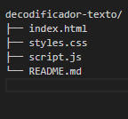

# word-encryptor-and-decryptor

# Decodificador de Texto

Este é um projeto de Decodificador de Texto que permite criptografar e descriptografar mensagens. 
A criptografia converte letras minúsculas em maiúsculas e vice-versa, além de aplicar uma cifra de deslocamento baseada na posição da letra. 
O projeto foi desenvolvido com HTML, CSS e JavaScript.

## Funcionalidades

- Criptografar texto inserido pelo usuário.
- Descriptografar texto inserido pelo usuário.
- Copiar o texto criptografado/descriptografado para a área de transferência.
- Interface responsiva para diferentes tamanhos de tela.

## Requisitos

- Navegador web moderno (Chrome, Firefox, Edge, Safari)

## Como Usar

1. Clone este repositório ou faça o download dos arquivos.
2. Abra o arquivo `index.html` em seu navegador.
3. Digite o texto que deseja criptografar ou descriptografar no campo de entrada.
4. Clique no botão "Criptografar" para criptografar o texto ou "Descriptografar" para descriptografar o texto.
5. O resultado aparecerá na caixa de resultado à direita.
6. Clique no botão "Copiar" para copiar o texto da caixa de resultado para a área de transferência.

## Estrutura do Projeto

